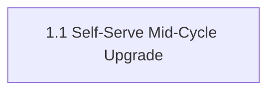

# AIRE State

- **Project**: Billing-Cycle Mid-Cycle Subscription Upgrade
- **Workflow Type**: epic
- **Started**: 2026-09-03T11:26:15Z
- **Current Phase**: IMPLEMENTATION
- **Current Stage**: Story 1.1 code generation + gates complete, review clean, committing and raising PR

## Stage Progress
### PLANNING PHASE
- [x] Workspace Detection
- [x] Reverse Engineering (SKIPPED — Atlas full coverage)
- [x] Requirements Analysis
- [x] User Stories
- [x] Dependency Graph
- [x] Workflow Planning
- [x] Application Design — SKIP (no new components/services)

### IMPLEMENTATION PHASE
- [x] Functional Design — SKIP (no new data models)
- [x] NFR Requirements — SKIP (tech stack unchanged, NFRs already in requirements.md)
- [x] NFR Design — SKIP (NFR Requirements skipped)
- [x] Infrastructure Design — SKIP (no infra change)
- [x] STOP CHECKPOINT (architecture.md, rubrics, CI pipeline, epic-level smoke test PASSED)
- [ ] Code Generation — awaiting `dev-implement`

## Tracker
- Type: LOCAL
- Parent Epic: Helix Solution Document 3157 — "Epic: Mid-Cycle Subscription Upgrade (Standard → Premium)"
- Epic URL: —
- Project Key / Repo / Org: —

## Helix MCP Binding
- **Server**: helix (mcp__helix__*)
- **Graph tool(s)**: codebase_agent_query, codebase_cypher_query, graph_change_impact — natural-language / Cypher / change-impact queries over the codebase knowledge graph
- **Docs tool(s)**: list_solution_documents_tool, get_solution_document_tool — Atlas solution documents (deepdive, epic, etc.)
- **Search tool(s)**: codebase_agent_query (doubles as free-text/graph search)
- **Estate / workspace id**: solution_id 874 ("Billing-Cycle-AIRE-V1-Demo"), repo Billing-Cycle @ main (bcec649e08f2dbec435c24066deae6a1d6d71192)
- **Resolved**: 2026-09-03T11:26:15Z

## Existing-System Context
- **Workspace type**: brownfield
- **Helix MCP**: connected
- **Source**: atlas
- **Components in scope**: backend/main.py (billing_data, billing route), frontend/src/pages/Billing.jsx, frontend/src/context/AuthContext.jsx
- **Atlas coverage**: 2 of 2 directly-touched components covered by deep-dive.md (13/13 analysis steps complete); knowledge-graph.md confirms no wider blast radius
- **Knowledge graph**: spec/plans/knowledge-graph.md
- **Recorded**: 2026-09-03T11:26:15Z

## Branching
- Base Branch: main
- Epic Branch: epic/3157-mid-cycle-subscription-upgrade
- Epic PR: (not raised — raised manually at cycle end via pr-generator)

## Extension Configuration
| Extension | Enabled | Decided At |
|---|---|---|
| Security Baseline | Yes (always mandatory) | Workflow start |
| Playwright Test Automation | Yes (always mandatory) | Workflow start |
| Resiliency Baseline | No | Requirements Analysis |
| Property-Based Testing | No | Requirements Analysis |

## CI Setup Gate (Section 4.1.2)
- **Answer**: proceed (2026-09-03T12:45:18Z) — user confirmed CLAUDE_CODE_OAUTH_TOKEN / SONAR_TOKEN / SONAR_HOST_URL secrets added and sonar.organization set (shailendrayadav0666) in sonar-project.properties.
- **sonarqube.enabled**: true. "sonarqube" gate appended to tests/.evals/config.json ci.gates.

## Epic-Level Smoke Test — HALTED then RESOLVED via skip (Section 4.0.6 / 4.1.3)
- **Status**: RESOLVED. User answered "skip" (2026-09-03T13:14:36Z) after all non-Sonar gates passed and Sonar's quality-gate step repeatedly failed for infrastructure reasons.
- **Fixed during this smoke test** (3 real bugs found and fixed, each verified by a subsequent run): (1) src/frontend/package-lock.json was gitignored and never committed — fixed; (2) unpinned setuptools broke semgrep's opentelemetry dependency (pkg_resources removed) — pinned setuptools<81; (3) no backend test suite existed — bootstrapped src/backend/tests/.
- **SonarQube**: disabled per Section 4.1.3 skip handling — tests/.evals/config.json sonarqube.enabled=false, "SonarQube scan"/"SonarQube quality gate" steps commented out in the workflow with a note naming the secrets/steps to re-enable, sonar-project.properties kept as-is. Semgrep (D3) and the Security Baseline review still fully enforce security.
- **Result**: PASSED (run 33760101210). PR #6 merged into the epic branch (commit 8b59a56) after manually completing the merge (`gh pr ready` + `gh pr merge` — the canonical smoke-test-epic.sh template has a bug: opens the PR as --draft but never un-drafts it before attempting to merge). Epic branch fast-forwarded locally.
- **Design complete — awaiting dev-implement.**

## Code Root
- `src/` — `src/backend` (FastAPI) and `src/frontend` (React/Vite). Matches default convention, no override needed.

## Reverse Engineering
- **Status**: SKIPPED — Atlas coverage Full (per `common/helix-atlas-integration.md` Section 5). `spec/plans/deep-dive.md` + `spec/plans/knowledge-graph.md` serve as the RE artifacts.

## team_size
- 2 (fixed default, never asked)

## story_creation_mode
- all-at-once (fixed default, never asked)

## target_story_count
- 1 (user override — explicitly confirmed after sizing-ceiling/parallelism trade-off was flagged; see runtime-artifacts/audit.md "User Stories — Story Count Answer & Trade-off Confirmation")

## Story Tracker

| Story | Title | Requires | Tracker ID | Status | PR | Merged | Start | End | Recorded |
|---|---|---|---|---|---|---|---|---|---|
| 1.1 | Self-Serve Mid-Cycle Upgrade: Standard → Premium | none | LOCAL | 🔵 In Development | https://github.com/Shailendrayadav0666/billing-cycle-copy2/pull/7 | no | 2026-09-03T13:20:36Z | — | 2026-09-03T13:39:00Z |

## Dependency Graph
- **team_size**: 2 (target ≥2 independent stories available at a time — not achievable this cycle by explicit user override: single story, see runtime-artifacts/audit.md)
- **Total stories**: 1 | **Immediately startable**: 1 | **Blocked**: 0
- **Inferred edges**: none — Story 1.1 has no prerequisites (only story in the set)

