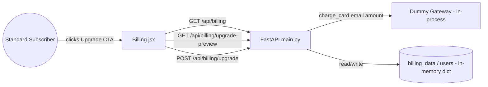

# Architecture — Billing-Cycle (Mid-Cycle Subscription Upgrade)

> **Version**: 1.0.0 · **Generated**: 2026-09-03T11:43:57Z · **AIRE**: v1.0
> **Derived from**: spec/plans/deep-dive.md (Atlas), spec/plans/knowledge-graph.md (Atlas), spec/plans/epic-brief.md, spec/plans/requirements.md, spec/plans/stories.md. Functional Design / NFR Requirements / NFR Design / Infrastructure Design / Application Design were all SKIPPED at Workflow Planning (spec/plans/executions.md) — no new components, data models, tech stack, or infrastructure. This document is assembled entirely from Atlas existing-system truth plus the Epic's own prescriptive Technical Design Notes, which are treated as an approved design input in lieu of a separate design stage.
> **Existing-system baseline**: Atlas via Helix MCP — solution_id 874 (Billing-Cycle-AIRE-V1-Demo), repo Billing-Cycle @ main (bcec649e08f2dbec435c24066deae6a1d6d71192)

## 1. System Context

Billing-Cycle is a small demo SaaS billing app: a FastAPI backend (`backend/main.py`) serving an in-memory `users` + `billing_data` store, and a React/Vite frontend (`frontend/src/pages/*.jsx`) that authenticates via an email-as-token pattern (`AuthContext.jsx`) and calls the backend's `/api/*` routes. This epic adds a self-serve plan-upgrade capability entirely inside this existing shape — no new service, no new datastore, no external payment provider.

## 2. Component Inventory

| Component | Responsibility | Status | Source |
|---|---|---|---|
| `Billing.jsx` | Plan card, usage meters, upgrade CTA, confirmation modal | existing (modified) | Atlas deep-dive.md |
| `main.py` — `billing_data` / `users` | In-memory billing state store | existing (modified — new fields written on upgrade) | Atlas deep-dive.md |
| `main.py` — `billing` route | `GET /api/billing` | existing (unchanged) | Atlas deep-dive.md |
| `main.py` — `GET /api/billing/upgrade-preview` | Server-side proration preview | new | epic-brief.md Technical Design Notes |
| `main.py` — `POST /api/billing/upgrade` | Executes upgrade via dummy gateway, mutates state | new | epic-brief.md Technical Design Notes |
| `charge_card()` | Deterministic dummy payment gateway (in-process function) | new | epic-brief.md Dummy Payment Gateway Specification |
| `AuthContext.jsx` | Supplies email/token used as the request identity | existing (unchanged) | Atlas deep-dive.md |

## 3. Layering and Boundaries

Unchanged from the existing system: FastAPI route handlers in `backend/main.py` read/write the module-level `billing_data`/`users` dicts directly (no repository layer exists in this codebase, and none is introduced). React page components in `frontend/src/pages/` own their own `fetch` calls and local state (no shared API client layer). The new endpoints and the new modal follow these exact existing conventions — no new layer is introduced.

## 4. Data Architecture

No new store, no schema migration. `billing_data[email]` and `users[email]` are extended with values already accounted for in their existing shape (`plan_name`/`plan`, `price`, `usages`, `on_demand_usage.notice`) — no new keys are added to the dict shape, only new values for existing keys. `renew_at` is read but never written by the upgrade flow.

## 5. API and Integration Contracts

| Endpoint | Method | Auth | Request | Success | Error |
|---|---|---|---|---|---|
| `/api/billing/upgrade-preview` | GET | `email` query param (existing token-as-email pattern) | — | 200 `{current_plan, new_plan, days_remaining, prorated_charge, next_renewal_price, renew_at}` | 409 `{"detail":"already_premium"}` |
| `/api/billing/upgrade` | POST | `email` in body (`UpgradeRequest`) | `{"email": str}` | 200 `{"status":"success","plan":"Premium","charge":<amt>}` | 402 `{"detail":"card_declined","message":...}` / 409 `{"detail":"already_premium"}` |

No external integration — `charge_card()` is a pure in-process function, not an HTTP call to a real gateway.

## 6. Cross-Cutting Decisions

- **AuthN/AuthZ**: unchanged — the existing email-as-identity pattern from `AuthContext.jsx` is reused verbatim for the two new endpoints; no new auth mechanism.
- **Error handling**: HTTP status codes carry the outcome (402 for declined payment, 409 for already-Premium) with a `detail`/`message` body — matches the existing FastAPI error-response convention already in use elsewhere in `main.py`.
- **Concurrency/idempotency**: single-process, in-memory, synchronous request handling (existing system property) — the upgrade mutation is a plain synchronous dict update, so no explicit locking is introduced or required at this scale.
- **Determinism**: `charge_card()` MUST remain a pure function of `email` (prefix check only) — no randomness, no clock read, no I/O.

## 7. Non-Functional Targets

| Concern | Target | Source | How it is verified |
|---|---|---|---|
| Determinism of gateway outcome | 100% deterministic on email prefix | REQ-NF-01 | Unit test: same email → same result, repeated calls |
| Atomicity of success-path mutation | No partially-updated state visible to a subsequent GET | REQ-NF-02 | Behavior test: GET immediately after POST reflects full new state or full old state, never partial |
| No new dependencies | 0 new pip/npm packages | REQ-NF-03 | Diff review of `requirements.txt` / `package.json` |

## 8. Infrastructure and Deployment

Unchanged — local FastAPI dev server (`uvicorn main:app`) + Vite dev server, as already documented in `src/README.md`. No infrastructure change in this epic.

## 9. Delta from the Existing System

| Area | Before (Atlas) | After | Reason |
|---|---|---|---|
| Billing page | Hardcoded `"Standard"` badge, no upgrade path | Dynamic badge from `plan_name`, conditional upgrade CTA + modal | REQ-F-01, REQ-F-02 |
| `backend/main.py` | Only `GET /api/billing` | + `GET /api/billing/upgrade-preview`, + `POST /api/billing/upgrade`, + `charge_card()`, + `PLANS`/`PREMIUM_QUOTAS`/`DAYS_IN_CYCLE` constants | REQ-F-03..REQ-F-10 |

## 10. Verifiable Constraints

### ARCH-01 — Server-side-only proration
- **Constraint**: The prorated charge amount is computed exclusively in `backend/main.py`; the frontend only displays the value returned by `GET /api/billing/upgrade-preview`.
- **Verifiable as**: No changed frontend file (`Billing.jsx`) contains proration arithmetic (subtraction/division/multiplication of plan prices or date deltas). Score 0 if any such computation appears client-side.
- **Weight**: 0.20
- **Source**: epic-brief.md Pricing & Proration Specification; REQ-F-04

### ARCH-02 — Deterministic dummy gateway
- **Constraint**: `charge_card(email, amount)` returns its result purely as a function of whether `email` starts with `"fail"` — no randomness, no external call, no clock read inside it.
- **Verifiable as**: The function body contains no `random`, no `requests`/`httpx`/network call, no `datetime.now()`/`time.time()` call. Score 0 if any of these appear inside `charge_card`.
- **Weight**: 0.20
- **Source**: epic-brief.md Dummy Payment Gateway Specification; REQ-NF-01

### ARCH-03 — No partial mutation on failure
- **Constraint**: On a declined payment (`card_declined`), `POST /api/billing/upgrade` must leave `users[email]` and `billing_data[email]` byte-for-byte unchanged.
- **Verifiable as**: The declined-path code branch (checked before any mutation) returns/raises before any assignment to `users[email]` or `billing_data[email]`. Score 0 if any mutating statement executes before the `charge_card` result is checked.
- **Weight**: 0.25
- **Source**: epic-brief.md Story 3 failure path; REQ-F-08, REQ-NF-02

### ARCH-04 — Already-Premium guard on both endpoints
- **Constraint**: Both `GET /api/billing/upgrade-preview` and `POST /api/billing/upgrade` return HTTP 409 `{"detail":"already_premium"}` when `billing_data[email]["plan_name"] == "Premium"`, before any other logic runs.
- **Verifiable as**: Each endpoint's handler contains an early guard clause checking `plan_name == "Premium"` ahead of proration/gateway logic. Score 0 if either endpoint is missing this guard or the guard runs after a mutation.
- **Weight**: 0.20
- **Source**: epic-brief.md Story 5; REQ-F-10

### ARCH-05 — No new dependencies
- **Constraint**: The feature ships with zero new entries in `backend/requirements.txt` or `frontend/package.json`.
- **Verifiable as**: Diff of both files shows no added dependency line. Score 0 if either file gains a new package for this feature.
- **Weight**: 0.15
- **Source**: epic-brief.md Referenced Paths; REQ-NF-03

*(Weights: 0.20+0.20+0.25+0.20+0.15 = 1.00)*

## 11. Explicitly Out of Scope

Downgrades, refunds/credits, Enterprise tier, real payment provider integration (Stripe/Braintree/etc.), email receipts/notifications, any change to auth/tasks/login/registration, and any new persistent datastore or infrastructure — per the Epic's own Out of Scope section and REQ-F-11.
