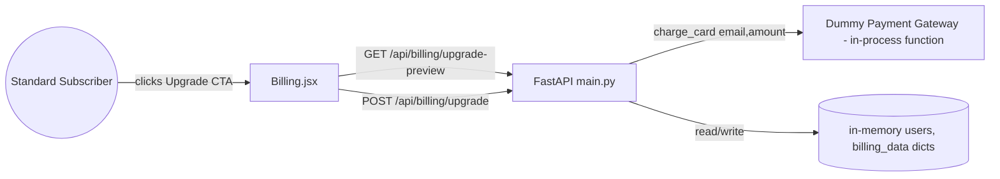

# Architecture — Billing-Cycle (Mid-Cycle Subscription Upgrade)

> **Version**: 1.0.0 · **Generated**: 2026-09-03T08:15:00Z · **AIRE**: v1.0
> **Derived from**: spec/plans/deep-dive.md (Atlas), spec/plans/epic-brief.md, spec/plans/requirements.md, spec/plans/stories.md. Functional Design, NFR Requirements/Design and Infrastructure Design were all SKIPPED at Workflow Planning (spec/plans/executions.md) — this document records that explicitly rather than inventing decisions for those sections.
> **Existing-system baseline**: Atlas via Helix MCP — solution_id 874 (Billing-Cycle-AIRE-V1-Demo), repo Billing-Cycle @ main, last_ingested_commit bcec649e08f2dbec435c24066deae6a1d6d71192

## 1. System Context

Billing-Cycle is a small monolith: a single FastAPI backend (`src/backend/main.py`) serving JSON over `/api/*`, backed by two in-memory Python dicts (`users`, `billing_data`) — no database. A Vite/React SPA (`src/frontend`) consumes it via a dev-server `/api` proxy (and, in production, the backend serves the built SPA as static files). This epic adds a self-serve upgrade path from the existing Billing page to two new backend endpoints; no new external caller or callee is introduced.

## 2. Component Inventory

| Component | Responsibility | Status | Source |
|---|---|---|---|
| `Billing.jsx` | Renders plan/usage, upgrade CTA, confirmation modal, success/error banners | existing (modified) | spec/plans/deep-dive.md |
| `main.py` — billing endpoints | `GET /api/billing`, plan/usage data shape | existing (unmodified) | spec/plans/deep-dive.md |
| `main.py` — upgrade endpoints | New `GET /api/billing/upgrade-preview`, `POST /api/billing/upgrade` | new | spec/plans/epic-brief.md |
| `charge_card()` | Deterministic dummy payment gateway | new | spec/plans/epic-brief.md |
| `AuthContext.jsx` | Supplies `token` (== user email) to API calls | existing (unmodified) | spec/plans/deep-dive.md |

## 3. Layering and Boundaries

Two layers only: the FastAPI route/handler layer in `main.py` (request validation via Pydantic, response shaping) and the in-memory "store" (`users`/`billing_data` dicts, accessed directly — there is no repository/ORM layer in this codebase). New endpoints follow the exact same pattern as the existing `login`/`register`/`billing`/`tasks` handlers: a Pydantic request model where a body exists, direct dict reads/writes, `HTTPException` for error responses. The frontend layer (`Billing.jsx`) calls the API only via `fetch` against relative `/api/...` paths — it never reaches into backend internals, and the reverse is also true.

## 4. Data Architecture

No schema/migration — `users[email]` and `billing_data[email]` are plain dicts mutated in place. This epic adds no new top-level keys; `POST /api/billing/upgrade` mutates existing keys only (`plan`, `price`, `plan_name`, `usages`, `on_demand_usage.notice`) and leaves `renew_at` untouched. Transaction boundaries: N/A (single-process, single in-memory store, no concurrent-request contention modeled in this POC).

## 5. API and Integration Contracts

| Endpoint | Method | Request | Success | Error |
|---|---|---|---|---|
| `/api/billing/upgrade-preview` | GET | Query `email` | 200 `{current_plan, new_plan, days_remaining, prorated_charge, next_renewal_price, renew_at}` | 401 not authenticated (email unknown); 409 `{"detail":"already_premium"}` |
| `/api/billing/upgrade` | POST | Body `{"email": str}` | 200 `{"status":"success","plan":"Premium","charge": float}` | 402 `{"detail":"card_declined","message":...}`; 409 `{"detail":"already_premium"}` |

Both follow the existing codebase's error-response convention: FastAPI `HTTPException(status_code, detail=...)`, matching `login`/`billing`/`tasks`. No auth model beyond the existing pattern (email-as-bearer-token in `AuthContext`) — unchanged by this epic.

## 6. Cross-Cutting Decisions

- **Error handling**: reuse `HTTPException` with a `detail` field; the 402 case additionally carries `message` (matches the Epic's exact response shape).
- **Determinism over randomness**: `charge_card()` MUST NOT use `random`, time-based jitter, or any network call — the entire epic's testability depends on this (REQ-NF-01).
- **No new logging/secrets/config**: no new environment variables, no new dependency, no PII beyond `email` (already logged nowhere today — this epic introduces no new logging).
- **Concurrency**: none modeled; this POC has no locking around dict mutation (consistent with the rest of the existing codebase).

## 7. Non-Functional Targets

| Concern | Target | Source | How it is verified |
|---|---|---|---|
| Determinism | 100% reproducible success/decline outcome keyed only on `email` prefix | requirements.md REQ-NF-01 | Unit test asserts identical result across repeated calls with the same email |
| No new dependencies | Zero new entries in `requirements.txt` / `package.json` | requirements.md REQ-NF-02 | Diff review of both manifests |
| Isolation | Zero lines changed in `/api/auth/*`, `/api/tasks*`, `/api/users/me`, `AuthContext.jsx` | requirements.md REQ-NF-03 | Diff scope check |

## 8. Infrastructure and Deployment

Unchanged — single FastAPI process, no containers/cloud resources in this POC beyond the mandatory `tests/.evals` eval sandbox (Podman, dev/test-time only). Frontend continues to be served either via Vite dev server (proxying `/api`) or as a static build mounted by FastAPI (`dist_dir` in `main.py`).

## 9. Delta from the Existing System

| Area | Before (Atlas) | After | Reason |
|---|---|---|---|
| Billing API surface | `GET /api/billing` only | + `GET /api/billing/upgrade-preview`, `POST /api/billing/upgrade` | Self-serve upgrade flow (Epic goal) |
| Billing.jsx | Static "Standard" badge, no CTA | Dynamic badge + conditional CTA + upgrade modal | REQ-F-01, REQ-F-02 |
| `billing_data[email]` | Fixed at Standard values after registration | Mutable in place to Premium values on successful upgrade | REQ-F-07 |

## 10. Verifiable Constraints

### ARCH-01 — Server-side-only monetary computation
- **Constraint**: The prorated charge is computed exclusively in the backend; the frontend never recomputes or independently derives it.
- **Verifiable as**: No changed frontend file (`Billing.jsx` or any new component) contains an arithmetic expression combining plan prices, days, or `DAYS_IN_CYCLE`. Score 0 if any such computation appears client-side instead of rendering the API response value.
- **Weight**: 0.25
- **Source**: spec/plans/requirements.md (REQ-NF-04), spec/plans/architecture.md Section 5

### ARCH-02 — Deterministic payment gateway
- **Constraint**: `charge_card(email, amount)` decides its result solely from `email`'s prefix, with no randomness, timing, or network dependency.
- **Verifiable as**: The changed `charge_card` function body contains no call to `random`, `time.sleep`, `requests`/`httpx`, or any non-deterministic source. Score 0 if any such call is present.
- **Weight**: 0.20
- **Source**: spec/plans/requirements.md (REQ-NF-01), spec/plans/architecture.md Section 6

### ARCH-03 — Isolation from unrelated flows
- **Constraint**: This epic's diff never touches `/api/auth/*`, `/api/tasks*`, `/api/users/me` handlers, or `AuthContext.jsx`.
- **Verifiable as**: The PR diff contains zero changed lines in those handlers/files. Score 0 if any line in them is modified.
- **Weight**: 0.20
- **Source**: spec/plans/requirements.md (REQ-NF-03)

### ARCH-04 — Already-Premium guard on both endpoints
- **Constraint**: Both `GET /api/billing/upgrade-preview` and `POST /api/billing/upgrade` return HTTP 409 `{"detail": "already_premium"}` when the target user's `plan_name` is already `"Premium"`, before any other logic runs.
- **Verifiable as**: Each endpoint's handler body contains an early guard clause checking `plan_name == "Premium"` that returns/raises 409 before computing proration or calling `charge_card`. Score 0 if either endpoint is missing this guard or the guard is not the first check.
- **Weight**: 0.20
- **Source**: spec/plans/requirements.md (REQ-F-10), spec/plans/stories.md (AC-5)

### ARCH-05 — No new dependency
- **Constraint**: This epic introduces zero new backend or frontend package dependencies.
- **Verifiable as**: `src/backend/requirements.txt` and `src/frontend/package.json` are byte-identical to their pre-epic versions. Score 0 if either file's dependency list changed.
- **Weight**: 0.15
- **Source**: spec/plans/requirements.md (REQ-NF-02)

**Weights**: 0.25 + 0.20 + 0.20 + 0.20 + 0.15 = 1.00

## 11. Explicitly Out of Scope

Downgrades, refunds/credits, an Enterprise tier, a real payment provider integration, email receipts/notifications, persistence (database), authentication changes, and multi-currency support — none of these exist in this system and none should be added speculatively by this epic.
