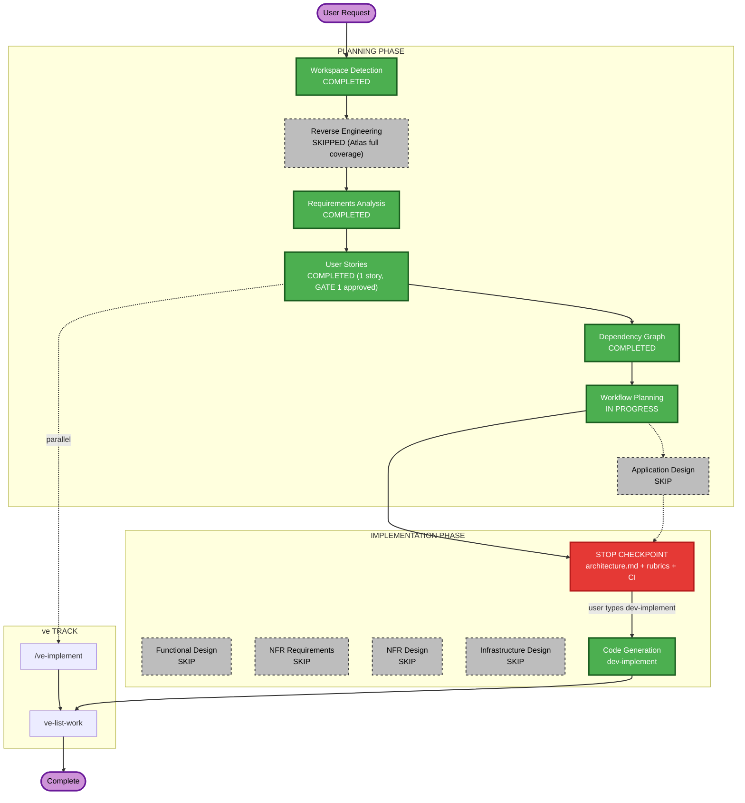

# Execution Plan

## Detailed Analysis Summary

### Transformation Scope (Brownfield)
- **Transformation Type**: Single-feature addition within existing component boundaries — no architectural transformation, no infrastructure/deployment model change.
- **Primary Changes**: 2 new backend endpoints + 1 new backend function + constants, all inside `backend/main.py`; new UI state/modal + conditional rendering inside `frontend/src/pages/Billing.jsx`.
- **Related Components**: `AuthContext.jsx` (read-only — supplies the email/token already used by every billing call); no other component references `billing`/`billing_data` per `spec/plans/knowledge-graph.md`.

### Change Impact Assessment
- **User-facing changes**: Yes — new CTA, modal, success banner, error message on the existing Billing page.
- **Structural changes**: No — no new services, no new files, no new architectural layer (FastAPI + React unchanged).
- **Data model changes**: No new persistent schema — `billing_data`/`users` are existing in-memory dicts, only new keys/values within existing shapes.
- **API changes**: Yes — 2 new REST endpoints (`GET /api/billing/upgrade-preview`, `POST /api/billing/upgrade`), additive only, no existing endpoint contract changes.
- **NFR impact**: Minor — determinism and atomicity of an in-memory mutation; no performance/scalability/security profile change to the existing system.

### Component Relationships (Brownfield)
- **Primary Component**: `backend/main.py`, `frontend/src/pages/Billing.jsx`
- **Infrastructure Components**: none
- **Shared Components**: `frontend/src/context/AuthContext.jsx` (consumed, unchanged)
- **Dependent Components**: none (confirmed via Helix knowledge-graph query)
- **Supporting Components**: none

### Risk Assessment
- **Risk Level**: Low — isolated, additive, in-memory, no external integrations
- **Rollback Complexity**: Easy — additive endpoints and UI state; revert = revert the two touched files
- **Testing Complexity**: Moderate — deterministic dummy gateway must be exercised on both branches (success + decline) plus the already-Premium guard

## Workflow Visualization

## Phases to Execute

### PLANNING PHASE
- [x] Workspace Detection (COMPLETED)
- [x] Reverse Engineering (SKIPPED — Atlas full coverage)
- [x] Requirements Analysis (COMPLETED)
- [x] User Stories (COMPLETED)
- [x] Dependency Graph (COMPLETED)
- [x] Workflow Planning (IN PROGRESS)
- [ ] Application Design — **SKIP**
  - **Rationale**: No new components/services; the story modifies existing `Billing.jsx`/`main.py` within their current boundaries (new endpoints on an existing router, new UI state in an existing page component) — no service-layer design or component dependency clarification needed.

### IMPLEMENTATION PHASE
- [ ] Functional Design — **SKIP**
  - **Rationale**: No new data models/schemas; the proration business rule is a single formula already fully specified in requirements.md/stories.md — no further design elaboration adds value.
- [ ] NFR Requirements — **SKIP**
  - **Rationale**: Tech stack (FastAPI + React/Vite) already determined and unchanged; no new performance/security/scalability requirement beyond what REQ-NF-01..05 already states in full.
- [ ] NFR Design — **SKIP**
  - **Rationale**: NFR Requirements skipped; no NFR pattern to incorporate beyond existing conventions.
- [ ] Infrastructure Design — **SKIP**
  - **Rationale**: No infrastructure/deployment change — feature runs entirely within the existing local FastAPI + Vite dev setup.
- [x] Code Generation — **EXECUTE (ALWAYS)**
  - **Rationale**: Implementation of Story 1.1 via `dev-implement`.

### ve TRACK (parallel — ve-initiated, not scheduled here)
- Test Plan — `/ve-implement 1.1`
- ve Sign-off — `ve-list-work`

## Estimated Timeline
- **Total Phases executing**: 6 of 11 (5 conditional stages skipped)
- **Estimated Duration**: ~1 day for Story 1.1 (Epic's own estimate: 3.5 days across the original 5-story breakdown; consolidated into one story per user override, same underlying scope)

## Success Criteria
- **Primary Goal**: Standard subscribers can self-serve upgrade to Premium mid-cycle with correct proration, deterministic payment simulation, and safe guard rails.
- **Key Deliverables**: 2 new backend endpoints, updated `Billing.jsx` UI, unit + Gherkin behavior coverage of all 7 ACs.
- **Quality Gates**: unit + coverage, Gherkin/behavior (B1-B3), full regression vs baseline, static D1-D7, automated code review incl. Security Baseline diff review, blocking J1/J2 judge gates.
- **Integration Testing**: `GET /api/billing` round-trip after upgrade reflects new plan/quotas correctly.
