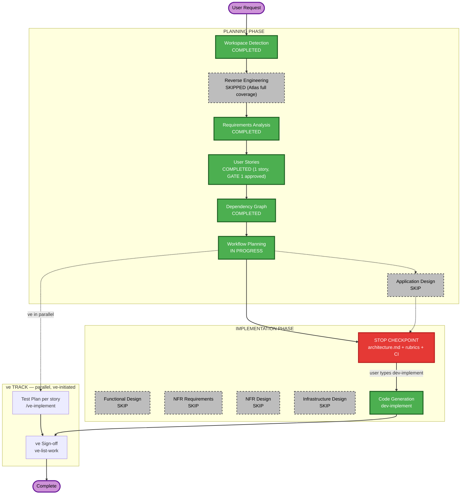

# Execution Plan

## Detailed Analysis Summary

### Transformation Scope (Brownfield)
- **Transformation Type**: Single component change — extends the existing FastAPI backend (`src/backend/main.py`) and the existing Billing page (`src/frontend/src/pages/Billing.jsx`). No new services, no new packages, no architectural transformation.
- **Primary Changes**: Two new REST endpoints (`GET /api/billing/upgrade-preview`, `POST /api/billing/upgrade`), a dummy in-process payment gateway function, new in-memory data mutations on the existing `users`/`billing_data` dicts, and new UI (CTA button + confirmation modal) on the existing Billing page.
- **Related Components**: None beyond `main.py` and `Billing.jsx` — `AuthContext.jsx` (read-only, for `token`/email) and `App.jsx` (routing) are unaffected.

### Change Impact Assessment
- **User-facing changes**: Yes — new CTA button, confirmation modal, success banner, error message on the Billing page.
- **Structural changes**: No — no new services, no new data stores, no schema migrations (in-memory dict POC).
- **Data model changes**: No — reuses the existing `users[email]` / `billing_data[email]` shapes, adding no new top-level fields (mutates existing `plan`/`plan_name`/`price`/`usages`/`on_demand_usage.notice` in place).
- **API changes**: Yes — 2 new endpoints, additive only; no existing endpoint's contract changes.
- **NFR impact**: No new NFR — reuses the existing FastAPI/Pydantic/CORS setup; no new dependency, no new infra.

### Risk Assessment
- **Risk Level**: Low — isolated to billing, no auth/data-persistence/infra changes, fully deterministic (no external calls).
- **Rollback Complexity**: Easy — additive endpoints + additive UI; reverting the PR fully reverts behavior.
- **Testing Complexity**: Simple — deterministic dummy gateway makes both the success and failure paths trivially reproducible for unit/behavior/API tests.

## Workflow Visualization

## Phases to Execute

### PLANNING PHASE
- [x] Workspace Detection (COMPLETED)
- [x] Reverse Engineering (SKIPPED — Atlas full coverage via Helix MCP)
- [x] Requirements Analysis (COMPLETED)
- [x] User Stories (COMPLETED — GATE 1 approved)
- [x] Dependency Graph (COMPLETED)
- [x] Execution Plan (this document)
- [ ] Application Design — **SKIP**
  - **Rationale**: No new components/services. The two new endpoints live in the existing `main.py` module beside the existing endpoints, following the same handler/Pydantic-model pattern already used for `login`/`register`/`billing`/`tasks`. No service layer or component boundary decisions are needed.

### IMPLEMENTATION PHASE
- [ ] Functional Design — **SKIP**
  - **Rationale**: The business logic (proration formula, gateway decision table) is already fully specified in `requirements.md` (REQ-F-04, REQ-F-06) with exact formulas and code snippets from the Epic — nothing further to design.
- [ ] NFR Requirements — **SKIP**
  - **Rationale**: No new NFRs and no tech-stack decision — reuses the existing FastAPI/Pydantic/React stack with zero new dependencies (REQ-NF-02).
- [ ] NFR Design — **SKIP** (dependent on NFR Requirements, which is skipped)
- [ ] Infrastructure Design — **SKIP**
  - **Rationale**: In-memory POC, no database, no cloud resources, no deployment-model change.
- [ ] Code Generation — **EXECUTE (ALWAYS)**
  - **Rationale**: Story 1 implements the entire epic; triggered via `dev-implement`.

### ve TRACK (parallel — ve-initiated, not scheduled here)
- Test Plan — run per story by ve with `/ve-implement`, in parallel with development
- ve Sign-off — run by ve with `ve-list-work` on the epic branch once the story PR merges

## Package Change Sequence
N/A — single-package monolith (`src/backend`, `src/frontend`), no multi-package coordination needed.

## Estimated Timeline
- **Total Phases**: 6 executed (Workspace Detection, Requirements Analysis, User Stories, Dependency Graph, Workflow Planning, Code Generation), 5 skipped (Reverse Engineering, Application Design, Functional Design, NFR Requirements/Design, Infrastructure Design)
- **Estimated Duration**: ~3.5 days (per the Epic's own story-level effort estimates, now consolidated into Story 1)

## Success Criteria
- **Primary Goal**: A Standard subscriber can self-serve upgrade to Premium with correct proration, deterministic payment simulation, and immediate data/UI refresh.
- **Key Deliverables**: 2 new backend endpoints, updated `Billing.jsx` UI, unit + behavior + API-contract test evidence, a clean automated code review.
- **Quality Gates**: Unit test coverage ≥ threshold, Gherkin behavior scenarios (B1/B2/B3), API & Contract Testing Gate (new endpoints), static D1–D7, blocking J1/J2 judge gates, Security Baseline diff-scoped review.
